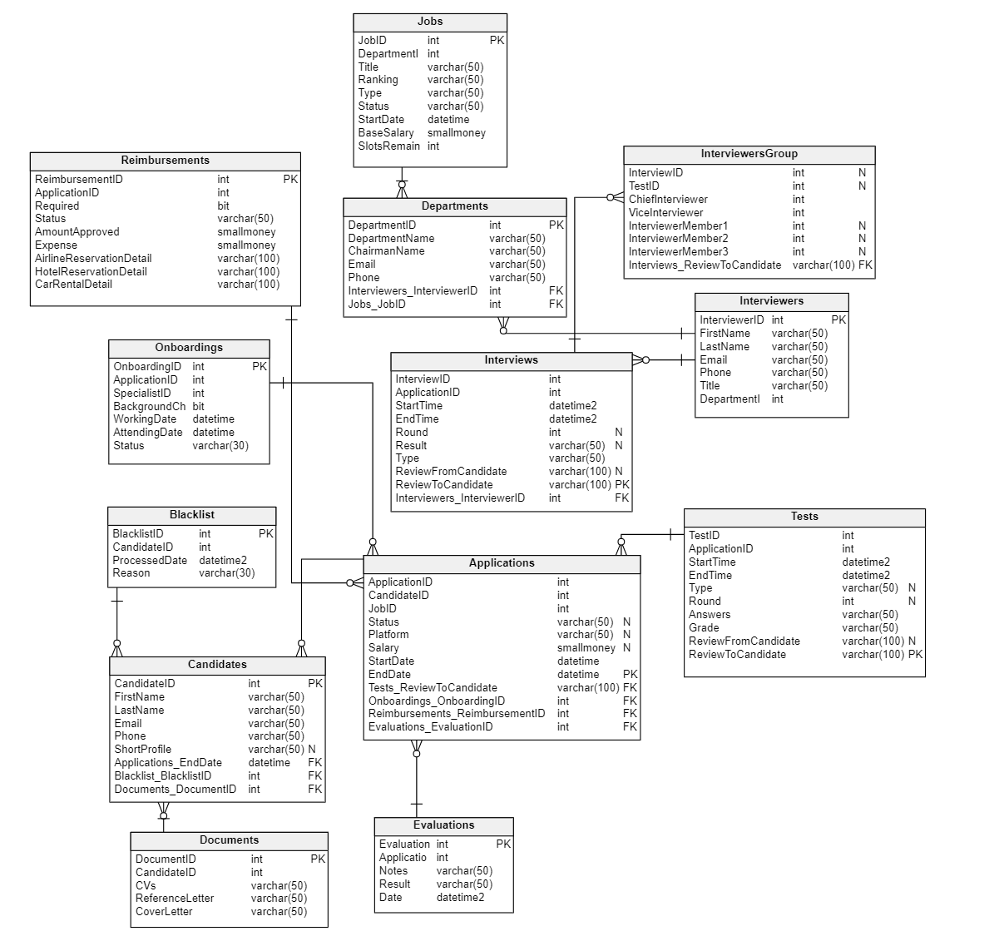

# HumanResourceDatabase
Applies Recruitment Schema in Human Resource Database with testcases in SQL Server 2022. It is a flat and agile database design with server security issue concerns of different roles in server, client, and admin side

## Introduction
This project is about Human Resources (HR) department database in company involved in developing and administering programs that are designed to increase the effectiveness of the organization. It includes the entire spectrum of creating, managing, and cultivating the employer-employee relationship.

The design, implement, and test a database for the Recruitment branch of the HR Department in a company is the major concern for this project. It includes interview process tracking, candidate profile management, job offerings etc.

Database name is HumanResource, recruitment branch of the company is abstracted as Recruitment Schema, resources reference from database is under domain *www.goodcompany/humanresources*, the designated company name is **GoodCompany**.

### Brief

- Seeding data provided to test the functionality of application status, knowledge test, interview, and onboarding info in general recruitment process
- 3rd normal form applied to reduce the memory usage and improve response time
- Automatic database diagram generation using **Vertabelo** other than SSMS service
- Triggers of table creation logs the system history by print messages in console
- Random length number and character forms the different ID in tables

## Security

Table that lists all server login entry and user, database roles granted different authorization. The login and user name are identical, user named after the initial of related roles, authorization given to role is based on database tables.

| Login/Role            | User    | Authorization | SELECT                                  | INSERT | UPDATE | DELETE |
| --------------------- | ------- | ------------- | --------------------------------------- | ------ | ------ | ------ |
| Interviewers          | Illinor |               | Candidates Applications              |        | \-A    |        |
| OnboardingSpecialists | Ottoman |               | Onboardings                             | \-     | \-     | \-     |
| Managers              | Madison |               | Departments                             | \-     | \-     | \-     |
| Candidates            | Charlie |               | Documents Candidates Applications | \-D    | \-D, C | \-D, C |

## Architecture

Tables in Human Resources Database Design, only single primary key is defined in each table, foreign keys are referenced between different tables. Departments table is defined in dbo schema as a side reference from other organizations in company, while other tables are defined under Recruitment schema which is the main focus in this project.

| Index | Notes                                     | Table Name        | Primary Key     | Other Columns            |                  |                 |                    |                    |                          |                        |                     |                  |
| ----- | ----------------------------------------- | ----------------- | --------------- | ----------------------- | ---------------- | --------------- | ------------------ | ------------------ | ------------------------ | ---------------------- | ------------------- | ---------------- |
| 1     | dbo Schema                                | Departments       | DepartmentID    | DepartmentName          | ChairmanName     | Email           | Phone              |                    |                          |                        |                     |                  |
| 2     | Recruitment Schema                        | Jobs              | JobID           | DepartmentID/Categories | Title            | Type            | SlotsRemained      | BaseSalary         | Status                   | StartDate              |                     |                  |
| 3     | Recruitment Schema                        | Candidates        | CandidateID     | FirstName               | LastName         | Email           | Phone              | ShortProfile       |                          |                        |                     |                  |
| 4     | Recruitment Schema                        | Interviewers      | InterviewerID   | FirstName               | LastName         | Email           | Phone              | Title              | DepartmentID             |                        |                     |                  |
| 5     | Store candidate information as URLs       | Documents         | DocumentID      | CandidateID             | CVs              | ReferenceLetter | CoverLetter        | OtherMaterial      |                          |                        |                     |                  |
| 6     | The current application status panel info | Applications      | ApplicationID   | CandidateID             | JobID            | Status          | Salary             | Platform           | StartTime                | EndTime                |                     |                  |
| 7     | Assigned according to application status  | Interviews        | InterviewID     | ApplicationID           | StartTime        | EndTime         | Round              | Result             | Type                     | ReviewFromCandidate    | ReviewToCandiate    |                  |
| 8     | Assigned according to application status  | Tests             | TestID          | ApplicationID           | StartTime        | EndTime         | Round              | Grade              | Type                     | Answer                 | ReviewFromCandidate | ReviewToCandiate |
| 9     | Do not have primary key                   | InterviewersGroup | InterviewID     | TestID                  | CheifInterviewer | ViceInterviewer | InterviewerMember1 | InterviewerMember2 | InterviewerMember3       |                        |                     |                  |
| 10    | Keep track of application status          | Evaluations       | EvaluationID    | ApplicationID           | Notes            | Result          | Date               |                    |                          |                        |                     |                  |
| 11    | Recruitment Schema                        | Reimbursements    | ReimbursementID | ApplicationID           | Required         | Status          | AmountApproved     | Expense            | AirlineReservationDetail | HotelReservationDetail | CarRentalDetail     |                  |
| 12    | Recruitment Schema                        | Onboardings       | OnboardingID    | ApplicationID           | SpecialistID     | BackgroundCheck | WorkingDate        | AttendingDate      | Status                   |                        |                     |                  |
| 13    | Recruitment Schema                        | Blacklist         | BlacklistID     | CandidateID             | ProcessedDate    | Reason          |                    |                    |                          |                        |                     |                  |

## Implementation
### Values
Table Application can have different status as ‘application scanning’, ‘Under Review ‘’n’’ ’, ‘Waiting’, ‘Rejected’, ‘on-call for next job opportunity’, ‘accepted’, ‘declined’, ‘negotiating’; column Platform can be ‘Career Site’, ‘Campus Event’, ‘Employee Recommended’, ‘online job board’, ‘Other’

Table Interviews and Tests only have Result/Grade of ‘Passed’, ‘Failed’

Table Jobs, column Position can be ‘IT Manager’, ‘software Developer’; column Type can be ‘Summer Internship’, ‘Full-time Job’, ‘Part-time Job’, ‘Contract-based’; Column Medium can be ‘Online’, ‘Onsite’, ‘Hybrid’; Column Categories can be ‘IT’, ‘Software Design’, ‘Testing’, ‘Finance’, ‘Marketing’, ‘Customer Services’

### Testing

Testing is divided into 2 parts. One is static data directly insert into database, another part is randomly generated data inserted follow by a sequence of procedures that represent the recruitment process. The dynamic test consists of 5 candidates application process as below:

- First Candidate successfully get offer through 3 reviews including 3 tests and 2 interviews, which only final review is on-site type. He passed all the tests and interviews, then received an offer. After negotiating, offer is accepted.
- Second candidate first applies job and was rejected in first review. His second application is rejected in second review and complaint about the interview process, which solved as a grant of new interview, and rejected again in third review.
- Third candidate is reviewed for 2 times and fulfill the recruitment requirement, but put into waiting list because of no job positions remaining
- Forth candidate has similar review process to candidate 3 which has 2 reviews and get offered, but candidate reject the offer this time
- Fifth candidate has simliar review process to candidate 4 and 3. But he fails to onboard in time, then was put into blacklist

### Overview

SQL Sever 2022 scripting implementation of database design, 5 transactions consist of the main testing script, and other functions or procedures are primary tools called by running database. 

| Index | View                         | Functions        | Triggers              | Transactions          | Stored Procedure         |                           |
| ----- | ---------------------------- | ---------------- | --------------------- | --------------------- | ------------------------ | ------------------------- |
| 1     | ApplicationAcceptRateOverall | fnGetRandomDate  | tgCreateInterview     | Candidate1OfferedJob  | spCreateReimbursement    | spUpdateApplication       |
| 2     | OnboardDateAvg               | fnGetInterviewNo | tgCreateCandidate     | Candidate2Complaint   | spCreateApplication      | spUpdateTest              |
| 3     | AllCandidateInfo             | fnGetTestNo      | tgCreateApplication   | Candidate3WaitedList  | spCreateCandidate        | spUpdateInterview         |
| 4     | BlacklistFrequency           | fnGetBlacklistNo | tgCreateTest          | Candidate4DeclinedJob | spCreateDocument         | spUpdateReimbursement     |
| 5     |                              |                  | tgCreateEvaluation    | Candidate5InBlacklist | spCreateInterview        | spUpdateReimbursement     |
| 6     |                              |                  | tgCreateReimbursement |                       | spCreateTest             | spPutCandidateInBlacklist |
| 7     |                              |                  |                       |                       | spCreateInterviewerGroup | spGetRanLenNo             |
| 8     |                              |                  |                       |                       | spCreateReimbursement    | spGetRanAlphaChar         |

## Diagram
Human Resource Database Diagram, a high level overview of table relationship showing reference of the foreign keys.
 

## Acknowledgement
The project requirements are provide by Dr.Ercanli in course CSE581, I worked out the final database design, seeding data and scripting programs. \
https://ecs.syracuse.edu/faculty-staff/ehat-ercanli